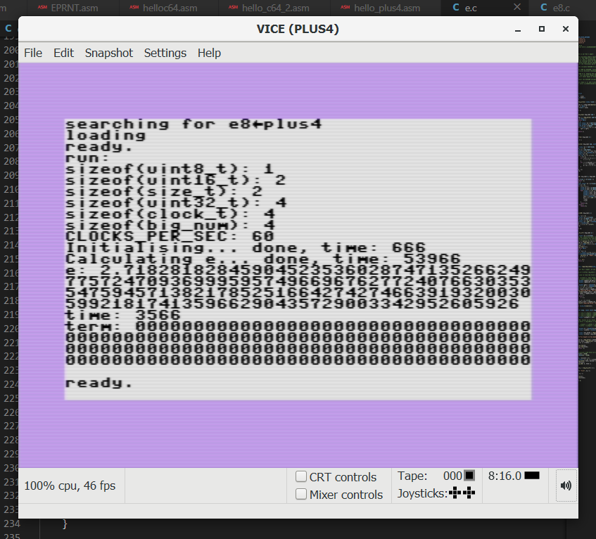

pointless_e
===========

Pointless evaluation of the digits of e. Mainly on retro platforms.

8bitdev
-------

This project uses `b8tool` for build, test and transferring the compiled or
assembled code to real hardware. This is part of the [8bitdev] submodule,
though it will `b8tool` will soon be split out into its own repo.

### b8tool Setup

The notes here on setting this up will be moved, with appropriate changes,
to the `b8tool` repo when that is split from [8bitdev]. In the meantime
this documentation preserves the steps taken in this particular repo to
get it working.

1. Create a top-level `Test` script that will call `b8tool` to do the setup
   and build. This is typically Bash (where `set -eu -o pipefail` is
   recommended), but can be any other language that can run programs.
2. Optional: check that your git submodules have been initialized. See
   `check_submodules()` in `Test`.
3. Strongly recommended: set variables for `B8_PROJDIR` (usually the root
   directory of your repo) and `b8tool` pointing to the `bin/b8tool`
   program. These locations are referenced by these names below.
   (Information on the various paths used by `b8tool` is in
   `…/b8tool/pylib/b8tool/path.py`.) Export `B8_PROJDIR` to an environment
   variable of that name.
4. Add `$B8_PROJDIR/requirements.txt` with a list of Python modules used by
   b8tool (see the file here for a list) plus any others you want in the
   virtual environment.
5. Add a top-level `conftest.py` containing `from pytest_pt import *` to
   add the plugin that discovers `.pt` files in this repo containing unit
   tests. Add an `src/conftest.py` containing `from cjs8bitdev.src.conftest
   import *` to bring in the unit test framework for assembler code. (The
   path here will change when that code is moved to b8tool.)
6. Source `…/pactivate -B $B8_PROJDIR` to install (if necessary) and set up
   the Python virtual environment. Do not use the `-b` option to specify a
   different build directory; `b8tool` currently supports only
   `$B8_PROJDIR/.build/`.
7. Run `$b8tool buildtoolset asl` to build The Macroassembler AS and
   similar commands to have `b8tool` build any other tools you need that it
   knows how to build. (You can also use tools that are in your existing
   system path.)
8. Run `$b8tool aslauto exe/ src/` or similar to discover and build source
   files that have `.pt` unit test cases that load them. (The details of
   how this works are yet to be documented.)
9. Run `$b8tool asl` with parameters for all the files that do not have
   unit test cases. (These are typically top-level files that integrate
   code from the modules under `$B8_PROJDIR/src/` via `include` statements
   to produce an executable for a particular platform.)

<!---------------------------------------------------------------------------->
[8bitdev]: https://github.com/0cjs/8bitdev
